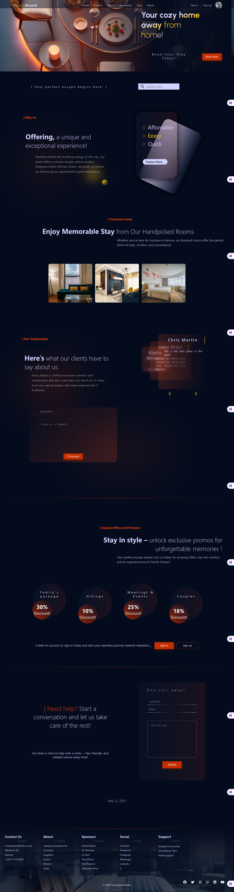
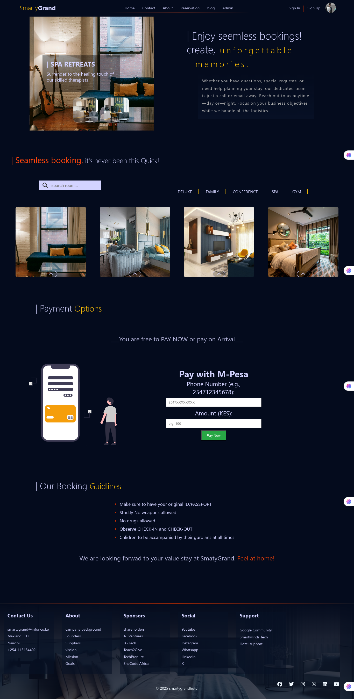
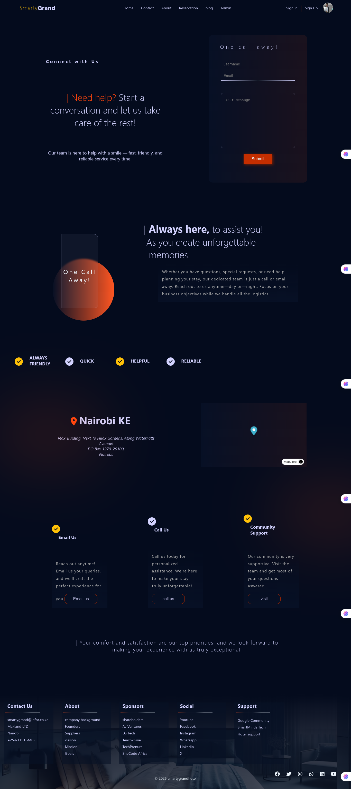

# 🏨 Smarty Grand Hotel – Web App

A modern hotel website built using the **MERN stack (React + Node.js + PostgreSQL)** with full frontend/backend integration. Guests can view hotel information, submit contact forms, and register/login securely.

---

## 🚀 Features

- 🔐 User authentication (Register, Login, Logout)
- 📩 Contact form with email sending
- 🗺️ Hotel location map (React Leaflet)
- 📷 Responsive design with images and animations
- 🛠 Admin-friendly backend setup

---

## 🛠 Tech Stack

<div align="center">
  
</div>

## 📸 Screenshots

### Home Page



### Reservation page



### Contact Page



### About Page


## ⚙️ Getting Started

### 📁 Clone the Repository

```bash
git clone https://github.com/SmartMinds1/SmartyGrand-Hotel.git
cd your-repo-name
```

---

### 📦 Frontend Setup (React)

```bash
cd client
npm install
npm start
```

> Runs on: `http://localhost:3000`

---

### 🖥️ Backend Setup (Node.js + Express + PostgreSQL)

```bash
cd server
npm install
```

### 🔐 Configure Environment Variables

Create a `.env` file in the `server` folder:

```env
PORT=5000
PG_HOST=localhost
PG_PORT=5432
PG_USER=your_pg_user
PG_PASSWORD=your_pg_password
PG_DATABASE=your_database_name

JWT_SECRET=your_jwt_secret
EMAIL_USER=your_email@example.com
EMAIL_PASS=your_email_password_or_app_token
CLIENT_URL=http://localhost:3000


NODE_ENV=production
REDIS_HOST=127.0.0.1
REDIS_PORT=6379
RATE_LIMIT_WINDOW_MS=900000
RATE_LIMIT_MAX=100
ALLOWED_ORIGINS=http://localhost:3000

# Google OAuth2 Credentials for Gmail sending
GOOGLE_CLIENT_ID=
GOOGLE_CLIENT_SECRET=
GOOGLE_REDIRECT_URI=
GOOGLE_REFRESH_TOKEN=
GMAIL_SENDER_EMAIL= your verified google cloud email

#MPESA credintials
MPESA_CONSUMER_KEY=
MPESA_CONSUMER_SECRET=
MPESA_PASSKEY=
MPESA_SHORTCODE=174379
MPESA_CALLBACK_URL=
```

> Don’t commit `.env` to GitHub – it contains sensitive info.

---

### ▶️ Run the Backend

```bash
npm run dev
```

> Runs on: `http://localhost:5000`

---

## 🗂️ Project Structure

```
/client     ← React frontend
/server     ← Node.js + Express backend
  ├── /routes
  ├── /controllers
  ├── /middlewares
  ├── /utils
  ├── /database
  └── index.js
```

## 📫 Contact

<div align="center">
  <a href="mailto:ampaulkaranja@gmail.com" target="_blank">
    
  </a>
  &nbsp;&nbsp;
  <a href="https://www.linkedin.com/in/paul-mwangi-3b23b8351" target="_blank">
    
  </a>
</div>
